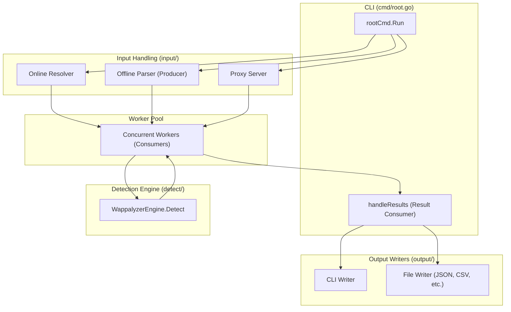

# Architecture Diagram: HyperWapp

## Data Flow
1. **Initialization:** CLI flags are parsed, and the `WappalyzerEngine` is initialized.
2. **Discovery (Offline):** The input directory is scanned to count total targets for progress tracking.
3. **Production:** An input-specific producer (Parser, Online Resolver, or Proxy) generates `OfflineInput` or `Target` objects.
4. **Processing:** A pool of concurrent workers consumes these inputs and invokes the `WappalyzerEngine`.
5. **Collection:** Detections are sent to a `resultCh`.
6. **Reporting:** `handleResults` processes the detections, maps them to Nuclei tags, and dispatches them to active writers.
